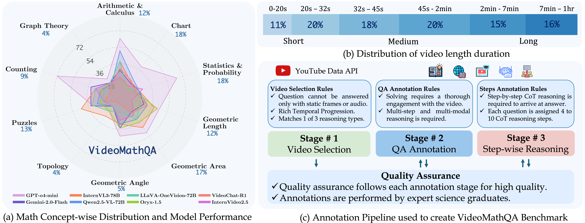
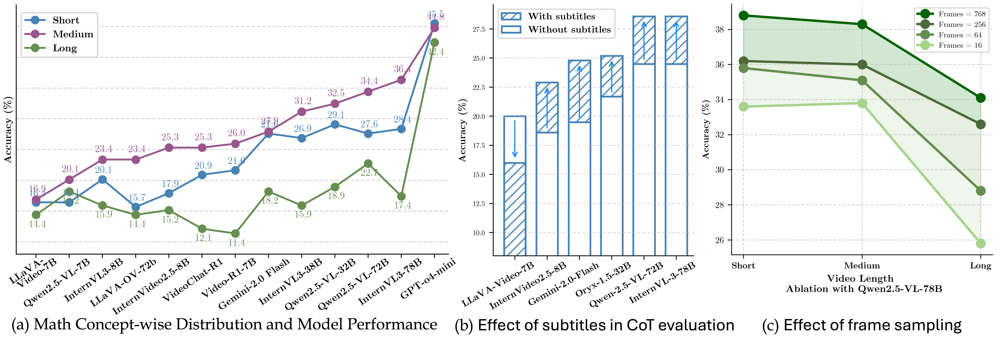
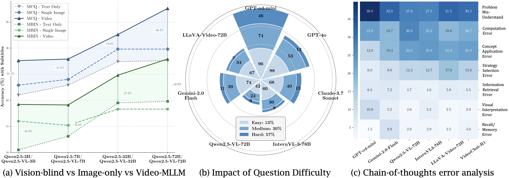

# VideoMathQA: Benchmarking Mathematical Reasoning via Multimodal Understanding in Videos
<!--  -->
<p align="center">
    
</p>

#### [Hanoona Rasheed](https://github.com/hanoonaR), [Abdelrahman Shaker](https://amshaker.github.io), [Anqi Tang](https://www.linkedin.com/in/AnqiTang-3a8929169/), [Muhammad Maaz](https://www.muhammadmaaz.com), [Ming-Hsuan Yang](https://scholar.google.com.pk/citations?user=p9-ohHsAAAAJ&hl=en), [Salman Khan](https://salman-h-khan.github.io/), [Fahad Khan](https://sites.google.com/view/fahadkhans/home)

#### **MBZUAI, University of California Merced, Google Research, Australian National University, Linköping University**

[](https://arxiv.org/abs/2311.03356)
[](https://mbzuai-oryx.github.io/VideoMathQA)
[](https://huggingface.co/datasets/MBZUAI/VideoMathQA)
[](https://hanoonar.github.io/VideoMathQA/#leaderboard-2)
[](https://hanoonar.github.io/VideoMathQA/#leaderboard)
[](https://github.com/EvolvingLMMs-Lab/lmms-eval/tree/main/lmms_eval/tasks/videomathqa)

---

## 📣 Announcement

Note that the Official evaluation for **VideoMathQA** is supported in the [`lmms-eval`](https://github.com/EvolvingLMMs-Lab/lmms-eval/tree/main/lmms_eval/tasks/videomathqa) framework. Please use this GitHub repository to **create or track any issues related to VideoMathQA** that you may encounter, so we can assist you.

---

## 💡 VideoMathQA

**VideoMathQA** is a benchmark designed to evaluate mathematical reasoning in real-world educational videos. It requires models to interpret and integrate information from **three modalities**, visuals, audio, and text, across time. The benchmark tackles the **needle-in-a-multimodal-haystack** problem, where key information is sparse and spread across different modalities and moments in the video.

<p align="center">
  <br>
  <em>The foundation of our benchmark is the needle-in-a-multimodal-haystack challenge, capturing the core difficulty of cross-modal reasoning across time from visual, textual, and audio streams. Built on this, VideoMathQA categorizes each question along four key dimensions: reasoning type, mathematical concept, video duration, and difficulty.</em>
</p>

---
## 🔥 Highlights

- **Multimodal Reasoning Benchmark:** VideoMathQA introduces a challenging **needle-in-a-multimodal-haystack** setup where models must reason across **visuals, text and audio**. Key information is **sparsely distributed across modalities and time**, requiring strong performance in fine-grained visual understanding, multimodal integration, and reasoning.

- **Three Types of Reasoning:** Questions are categorized into: **Problem Focused**, where the question is explicitly stated and solvable via direct observation and reasoning from the video; **Concept Transfer**, where a demonstrated method or principle is adapted to a newly posed problem; **Deep Instructional Comprehension**, which requires understanding long-form instructional content, interpreting partially worked-out steps, and completing the solution.

- **Diverse Evaluation Dimensions:** Each question is evaluated across four axes, which captures diversity in content, length, complexity, and reasoning depth.
   **mathematic concepts**, 10 domains such as geometry, statistics, arithmetics and charts; **video duration** ranging from 10s to 1 hour long categorized as short, medium, long; **difficulty level**; and **reasoning type**.  

- **High-Quality Human Annotations:** The benchmark includes **420 expert-curated questions**, each with five answer choices, a correct answer, and detailed **chain-of-thought (CoT) steps**. Over **2,945 reasoning steps** have been manually written, reflecting **920+ hours** of expert annotation effort with rigorous quality control.

---
## 📊 Overview and Analysis of VideoMathQA

### 🔍 Examples from the Benchmark
We present example questions from <strong>VideoMathQA</strong> illustrating the three reasoning types: Problem Focused, Concept Transfer, and Deep Comprehension. The benchmark includes evolving dynamics in a video, complex text prompts, five multiple-choice options, the expert-annotated step-by-step reasoning to solve the given problem, and the final correct answer as shown above.
<p align="center">
  
</p>

---

### 📈 Overview of VideoMathQA
We illustrate an overview of the <strong>VideoMathQA</strong> benchmark through: <strong>a)</strong>&nbsp;The distribution of questions and model performance across ten mathematical concepts, which highlights a significant gap in the current multimodal models and their ability to perform mathematical reasoning over videos. <strong>b)</strong>&nbsp;The distribution of video durations, spanning from short clips of 10s to long videos up to 1hr. <strong>c)</strong>&nbsp;Our three-stage annotation pipeline performed by expert science graduates, who annotate detailed step-by-step reasoning trails, with strict quality assessment at each stage.
<p align="center">
  
</p>

---

### 🎞️ Effect of Video Length, Subtitles, and Frame Count on Multimodal Reasoning
We analyze the performance of models on <strong>VideoMathQA</strong> under different settings: <strong>a)</strong> Across video duration categories, <strong>b)</strong> With and without subtitles, and <strong>c)</strong> Varying the number of input frames. We observe that models perform best on medium-length videos, and overall accuracy improves with the inclusion of subtitles and more frames during evaluation.
<p align="center">
  
</p>

---

### ⚠️ Understanding Model Limitations in VideoMathQA Reasoning
We conduct an in-depth analysis of model limitations in <strong>VideoMathQA</strong>. <strong>a)</strong>&nbsp;We compare vision-blind, image-only, and video models, showing the necessity of video-level understanding for success. <strong>b)</strong>&nbsp;We show the distribution of questions across three difficulty levels and varying reasoning depths, highlighting the correlation between difficulty and model performance. <strong>c)</strong>&nbsp;We analyze CoT-based error types, revealing that most errors stem from misinterpreting the question or missing crucial multimodal cues.
<p align="center">
  
</p>

---

## 📜 Citation
```bibtex
  @article{rasheed2025videomathqa,
          title={VideoMathQA: Benchmarking Mathematical Reasoning via Multimodal Understanding in Videos},
          author={Rasheed, Hanoona and Shaker, Abdelrahman and Tang, Anqi and Maaz, Muhammad and Yang, Ming-Hsuan and Khan, Salman and Khan, Fahad S.},
          journal={arXiv preprint arXiv:EDIT},
          year={2025}
  }
```

---
## 🙏 Acknowledgement
We thank LMMs-Lab for their open-source contributions, particularly LMMs-Eval, which we used to evaluate models and which serves as the official toolkit for evaluating on our benchmark.

---
[](https://www.ival-mbzuai.com)
[](https://github.com/mbzuai-oryx)
[](https://mbzuai.ac.ae)
